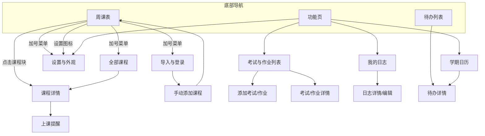

# NJU Timenote — UI 结构化说明

> 真源：`UI/nju-timetable.pen`（主原型画板）+ `docs/requirements document.md`  
> 用途：供 AI / 开发识别各页面结构、组件位置、样式与交互。  
> 设计令牌：颜色与开关等优先使用 Pencil Variables（如 `$theme.bg`、`$theme.accent`、`$theme.surface` 等），深浅色由 `mode`（light/dark）切换。

---

## 全局约定

### 主导航（底部胶囊，仅三页展示）

| 项　 | 样式　　　　　　　　　　　　　　　　　　 | 交互　　　　　　　|
| ------| ------------------------------------------| -------------------|
| 课表 | 胶囊内文字标签；选中项主题色填充底、白字 | 跳转 **周课表**　 |
| 功能 | 同上　　　　　　　　　　　　　　　　　　 | 跳转 **功能页**　 |
| 待办 | 同上　　　　　　　　　　　　　　　　　　 | 跳转 **待办列表** |

未选中项：透明底、次要灰色文字。胶囊容器：圆角 36、白底、描边。

### 系统状态栏（各页顶栏上方预留区）

| 组件 | 位置 | 样式 | 交互 |
| --- | --- | --- | --- |
| 系统时间 | 状态栏居中 | 文字「9:41」，Inter 15 semibold | 仅显示 |
| 信号/电量区 | 状态栏右侧 | 占位 frame | 仅显示 |

### 二级页顶栏返回

| 组件 | 位置 | 样式 | 交互 |
| --- | --- | --- | --- |
| 返回箭头 | 标题行左侧（相对状态栏下移） | Lucide `chevron-left` 图标 | 返回上一页 |

### 布尔开关（全局统一）

| 组件 | 样式 | 交互 |
| --- | --- | --- |
| 滑动开关 | 轨道圆角 16 + 滑块圆角 13；开：主题色轨道、滑块右偏；关：灰轨道、滑块左偏 | 点击切换开/关 |

---

## 1. 周课表（02 Week Timetable）

### 进入页面渠道

- App 启动默认页（重进 App 始终先显示**本人课表**）
- 底部导航 **课表**
- 手动添加课程 **保存并返回课表**
- 其它页返回至主导航的课表 Tab

### 页面组成及交互

主布局：顶栏 appHeader → 日期条 dr → 课表主体 scheduleBody（左节次列 + 右栅格）→ 底部导航 tabWrap。右上角可浮层展示加号菜单 `dd`（展开态）。

整体可垂直滚动课表区域；周次/月份可切换；点击课程块进入课程详情；冲突课程左右分栏（需求约定，栅格内实现）。

---

#### 状态栏区 `status` / 顶栏第一行 `row1`

| 组件 | 位置 | 样式 | 交互 |
| --- | --- | --- | --- |
| 返回占位 | row1 左 | chevron-left 22px（原型 disabled） | 仅显示 |
| 系统时间 | row1 中 | 文字 | 仅显示 |
| 设置图标 | row1 右 | Lucide `settings` 20px | 跳转 **设置与外观** |

#### 顶栏第二行 `WSrA7`（课表标题区）

| 组件 | 位置 | 样式 | 交互 |
| --- | --- | --- | --- |
| 上一周 | 标题行左 | chevron-left 18px | 切换至上一教学周 |
| 课表名称 + 下拉 | 标题行中 | 大标题「我的课表」Geist 28 bold + chevron-down 16px | 点击展开**课表选择**（查看本人/其它课表）；收起为 chevron-down，展开态见需求 |
| 加号占位 | 标题行右 | 18×18 frame（展开菜单时显示 + 或菜单锚点） | 点击展开/收起 **加号菜单** |

#### 周次提示（可选/示意）

| 组件 | 位置 | 样式 | 交互 |
| --- | --- | --- | --- |
| 第 N 周 | 顶栏下方居中 | 次要色 14px「第 6 周」（原型 enabled:false） | 可表示当前周；跳转任意周由实现扩展 |

#### 加号下拉菜单 `dd`（浮层，展开态）

| 组件 | 位置 | 样式 | 交互 |
| --- | --- | --- | --- |
| 菜单容器 | 顶栏右上绝对定位 | 白底圆角 12 竖向列表、描边 | 点击外侧收起 |
| 导入课表 | 菜单项 1 | 文字 14px | 跳转 **导入与登录** |
| 界面修改 | 菜单项 2 | 文字 14px | 跳转 **设置与外观**（外观/布局相关） |
| 全部课程 | 菜单项 3 | 文字 14px | 跳转 **全部课程** |

#### 日期条 `dr`（毛玻璃横条）

| 组件 | 位置 | 样式 | 交互 |
| --- | --- | --- | --- |
| 月份/周 | 最左列 m0 | 「4月」「第6周」小字 | 仅显示 |
| 周一至周日 | 横向 7 列 | 每列：星期小字 + 日期（如「周四」「04/09」） | 仅显示；**今日列**高亮：浅灰底 + 主题色描边，日期主题色加粗 |
| 条容器 | 日期条整体 | 圆角 12、毛玻璃 fill `$theme.glass`、背景模糊 | 仅显示 |

#### 节次列 `tcol`（左侧，最多 12 节）

| 组件 | 位置 | 样式 | 交互 |
| --- | --- | --- | --- |
| 节次块 p1–p12 | 左列自上而下 | 每行：节次序号 bold 16 + 起止时间 9px 灰色（如「1」「08:00」「08:50」） | 仅显示；与右侧栅格对齐 |
| 列容器 | 左列 | 宽 48、毛玻璃、右侧分隔线 | 仅显示 |

#### 课表栅格 `gridCanvas`

| 组件 | 位置 | 样式 | 交互 |
| --- | --- | --- | --- |
| 横向网格线 hg1–hg12 | 栅格内 | 浅色水平线，按节次分行 | 仅显示 |
| 纵向网格线 gl1–gl6 | 栅格内 | 浅色竖线，按星期分列 | 仅显示 |
| 课程块 | 对应星期列 × 节次行 | 圆角 14 毛玻璃卡片；半透明马卡龙色底；白描边；块内**课程名** bold 9px + **地点**灰色 8px 第一行小字；文字带浅色阴影保证可读 | 点击进入 **课程详情**；长按可编辑/删除/复制/拖拽（保存提示文案） |
| 冲突块 | 同格多课 | 左右分栏显示（需求） | 同上 |

示例课程块（原型）：微积分 II、数字逻辑、高级编程、线性代数、大学英语、离散数学、思修、数据结构、操作系统、计算机网络、编译原理、数据库等。

#### 底部导航 `tabWrap`

| 组件 | 位置 | 样式 | 交互 |
| --- | --- | --- | --- |
| 三 Tab 胶囊 | 页面底部 | 课表（选中主题色）、功能、待办 | 切换主导航页 |

---

## 2. 导入与登录（01 Import & Login）

### 进入页面渠道

- 周课表加号菜单 → **导入课表**
- 设置/课表管理相关流程中的新建课表（与导入目标课表联动）

### 页面组成及交互

可滚动主内容区；选择导入方式后执行同步；底部选择导入到哪份课表。

---

#### 状态栏 `status`

| 组件 | 位置 | 样式 | 交互 |
| --- | --- | --- | --- |
| 返回 | 左 | chevron-left（disabled 示意） | 返回周课表 |
| 时间 | 中 | 9:41 | 仅显示 |

#### 标题区

| 组件 | 位置 | 样式 | 交互 |
| --- | --- | --- | --- |
| 返回 + 标题 | 内容顶 | chevron-left 18 + 「导入课表」28 bold | 返回 |
| 副标题 | 标题下 | 15px 次要色「登录教务系统或选择其他方式同步」 | 仅显示 |

#### 教务登录卡片 `loginCard`

| 组件 | 位置 | 样式 | 交互 |
| --- | --- | --- | --- |
| 区块标题 | 卡片内 | 「教务系统」13px semibold | 仅显示 |
| 说明 | 卡片内 | 14px 正文 | 仅显示 |
| 登录并同步 | 卡片底 | 主题色圆角 24 按钮，白字 16 semibold | 跳转统一认证 → 拉取教务课表并导入 |

#### 其他方式

| 组件 | 位置 | 样式 | 交互 |
| --- | --- | --- | --- |
| 分区标题 | 列表上 | 「其他方式」 | 仅显示 |
| 手动添加课程 | 行 r1 | 白底圆角 14 行，左标题 + 右 › | 跳转 **手动添加课程** |
| 课表截图 OCR | 卡片 r3 | 标题 + 说明 + 主题色链接「选择周次范围 ›」 | 上传截图 → 选择教学周范围 → 批量生成课程 |

#### 导入到 `ch`

| 组件 | 位置 | 样式 | 交互 |
| --- | --- | --- | --- |
| 分区标题 | 底部 | 「导入到」 | 仅显示 |
| 我的课表 | 胶囊 p1 | 白底描边胶囊 | 选中为目标课表 |
| 新建课表 | 胶囊 edrow | 主题色底 + pencil 图标 +「新建课表」 | 创建新课表并作为导入目标 |

---

## 3. 课程详情（03 Course Detail）

### 进入页面渠道

- 周课表点击课程块
- **全部课程** 列表项
- 其它模块关联课程名跳转（若实现）

### 页面组成及交互

二级页，无底部导航；可滚动；右上角编辑/保存；底部删除课程。

---

#### 状态栏 + 页头 `hdr2`

| 组件 | 位置 | 样式 | 交互 |
| --- | --- | --- | --- |
| 返回 + 标题 | 左 | 「课程详情」28 bold | 返回 |
| 编辑/完成 | 右 | 主题色胶囊：铅笔态「编辑」/ 打勾态「编辑中」 | 切换编辑模式；非编辑为铅笔图标，编辑中为 check + 文案 |

#### 课程名

| 组件 | 位置 | 样式 | 交互 |
| --- | --- | --- | --- |
| 课程标题 | 页头下 | 17px semibold「软件工程」 | 编辑模式下可改 |

#### 设置课程提醒 `remind`

| 组件 | 位置 | 样式 | 交互 |
| --- | --- | --- | --- |
| 行 | 卡片行 | 左文案 + 右 › | 跳转 **上课提醒**（按课程设置） |

#### 成绩构成 `cg`

| 组件 | 位置 | 样式 | 交互 |
| --- | --- | --- | --- |
| 标题 | 卡片 | 「成绩构成」13px 标签 | 仅显示 |
| 内容 | 卡片 | 如「平时 30% · 期中 30% · 期末 40%」 | 编辑模式可改 |

#### 评价维度 `rv`

| 组件 | 位置 | 样式 | 交互 |
| --- | --- | --- | --- |
| 标题 | 卡片 | 「评价维度」 | 仅显示 |
| 多行维度 | 卡片 | 给分/风格/Workload/考核/作业量等 14px 行 | 编辑模式可改 |

#### 资料 `dc`

| 组件 | 位置 | 样式 | 交互 |
| --- | --- | --- | --- |
| 标题行 | 卡片顶 | 「资料」+ 右侧主题色「上传」胶囊（+ 图标） | 上传文件 |
| 资料行 | 列表 | 文件名主题色 14px；**编辑模式**右侧主题色 × 图标 | 点击文件名打开；× 删除文件（可二次确认） |
| 浏览模式 | — | 无 × | 仅打开 |

#### 作业与考试 `hw`

| 组件 | 位置 | 样式 | 交互 |
| --- | --- | --- | --- |
| 标题 | 卡片 | 「作业与考试」 | 仅显示 |
| 列表文案 | 卡片 | 多行「· 第 N 周：…」 | 编辑模式可改；可链到考试作业模块 |

#### 课程网站 `ln`

| 组件 | 位置 | 样式 | 交互 |
| --- | --- | --- | --- |
| 行 | 单行卡片 | 左「课程网站」+ 右主题色「在浏览器打开 ›」 | 外链跳转系统浏览器 |

#### 教师信息 `tf`

| 组件 | 位置 | 样式 | 交互 |
| --- | --- | --- | --- |
| 标题 + 多行 | 卡片 | 办公室、答疑时间、邮箱等 | 编辑模式可改 |

#### 备注 `nm`

| 组件 | 位置 | 样式 | 交互 |
| --- | --- | --- | --- |
| 标题 + 正文 | 卡片 | 多行备注 | 编辑模式可改 |

#### 删除课程 `delCourse`

| 组件 | 位置 | 样式 | 交互 |
| --- | --- | --- | --- |
| 按钮 | 页面最底部 | 白底描边条，主题色「删除课程」15 semibold | 二次确认 → 删除并返回；级联待办/考试关联按实现策略 |

#### 设计提示

| 组件 | 位置 | 样式 | 交互 |
| --- | --- | --- | --- |
| 提示文案 | 底部 | 11px 灰字：未编辑显示铅笔，编辑后显示打勾 | 仅显示 |

> 主应用**不提供**课程论坛/社区入口（扩展稿独立文件）。

---

## 4. 上课提醒（04 Class Reminders）

### 进入页面渠道

- 课程详情 → **设置课程提醒**

### 页面组成及交互

二级页；配置课前提醒粒度、提醒方式、智能跳过、关联课程。

---

#### 页头

| 组件 | 位置 | 样式 | 交互 |
| --- | --- | --- | --- |
| 返回 + 标题 | 顶 | 「上课提醒」28 bold | 返回 |

#### 课前多久提醒

| 组件 | 位置 | 样式 | 交互 |
| --- | --- | --- | --- |
| 分区标题 | 内容区 | 13px semibold | 仅显示 |
| 时间胶囊 | 横向 rg | 10/15/30 分钟等；选中主题色填充白字，未选白底描边 | 单选切换（原型示例选中 10 分钟；需求含 5/10/15/30） |

#### 提醒方式 `row`

| 组件 | 位置 | 样式 | 交互 |
| --- | --- | --- | --- |
| 通知 | 列表行 | 左标签 + 右状态「开/关」 | 切换 |
| 静音 | 列表行 | 同上 | 切换 |
| 震动 | 列表行 | 同上 | 切换 |
| 铃声 | 列表行 | 右「默认」等 | 选择铃声 |

#### 智能跳过

| 组件 | 位置 | 样式 | 交互 |
| --- | --- | --- | --- |
| 法定节假日不提醒 | 行 sk | 左说明 + 右「已开启」主题色 | 开关/跳转配置 |
| 对应课程 | 行 cr | 左「对应课程」+ 右课程名 | 选择关联课程 |

---

## 5. 考试与作业列表（05 Exams & Homework）

### 进入页面渠道

- **功能页** → 考试与作业
- 底部导航经功能页进入

### 页面组成及交互

二级页；筛选 + 排序；列表进详情；右上角新建。

---

#### 页头

| 组件 | 位置 | 样式 | 交互 |
| --- | --- | --- | --- |
| 返回 + 标题 | 左 | 「考试与作业」 | 返回 |
| 新建 | 右 | 主题色胶囊 + 图标 +「新建」 | 跳转 **添加考试/作业** |

#### 筛选 `tb`

| 组件 | 位置 | 样式 | 交互 |
| --- | --- | --- | --- |
| 全部 | 胶囊 | 选中主题色 | 筛选全部 |
| 未完成 | 胶囊 | 未选描边 | 筛选未完成 |
| 已完成 | 胶囊 | 未选描边 | 筛选已完成 |

#### 列表项

| 组件 | 位置 | 样式 | 交互 |
| --- | --- | --- | --- |
| 考试卡片 ec | 列表 | 标题「操作系统 · 期末」+ 副文案倒计时/时间 | 点击进入 **考试/作业详情** |
| 作业卡片 as | 列表 | 标题 + DDL +「重复：每周」主题色 | 同上 |

#### 排序说明

| 组件 | 位置 | 样式 | 交互 |
| --- | --- | --- | --- |
| 排序文案 | 列表下 | 「排序：截止时间 ↑」次要 13px | 点击可改排序（若实现） |

---

## 6. 设置与外观（06 Settings & Appearance）

### 进入页面渠道

- 周课表顶栏 **设置** 图标
- 周课表加号菜单 → **界面修改**
- **功能页** → 设置

### 页面组成及交互

二级页；分组列表 + 开关；课表管理；本地备份与导出；无云端备份。

---

#### 页头

| 组件 | 位置 | 样式 | 交互 |
| --- | --- | --- | --- |
| 返回 + 标题 | 顶 | 「设置」 | 返回 |

#### 课表管理 `timetables`

| 组件 | 位置 | 样式 | 交互 |
| --- | --- | --- | --- |
| 分组标题 | 卡片顶 | 「课表管理」 | 仅显示 |
| 本人课表行 | 列表 | 课表名，**无**右侧删除 | 不可删除默认主课表 |
| 其它课表行 | 列表 | 课表名 + 主题色 × 图标 | 删除该份课表；至少保留一份时拦截并提示 |
| 说明 | 卡片底 | 11px 灰字规则说明 | 仅显示 |

#### 外观 `ap`

| 组件 | 位置 | 样式 | 交互 |
| --- | --- | --- | --- |
| 外观 | 行 | 右 › | 进入外观子页（若拆分） |
| 深色模式 | 行 | 右滑动开关 | 切换深色；浅色为默认 |
| 跟随系统 | 行 | 右滑动开关 | 跟随系统深浅色 |
| 全局主题色 | 行 | 色块 + › | 取色器/色值配置 `$theme.accent` |
| 背景 | 行 | › | 配置背景 |
| 课表透明度 | 行 | › | 调节透明度 |
| 重新随机生成课表配色方案 | 行 | › | 随机重分配课程色 |

#### 课表与作息 `st2`

| 组件 | 位置 | 样式 | 交互 |
| --- | --- | --- | --- |
| 节次时间 | 行 | 右「编辑」主题色 | 编辑每节课起止时间 |
| 界面修改（布局与样式） | 行 | › | 布局/样式相关设置 |
| 隐藏周末 | 行 | 开关 | 隐藏周六日列 |
| 隐藏无课行 | 行 | 开关（原型为开） | 折叠无课节次行 |
| 学期开学日 | 行 | 右日期「9 月 1 日」 | 选择开学日 |

#### 数据与分享 `bk`

| 组件 | 位置 | 样式 | 交互 |
| --- | --- | --- | --- |
| 本地备份 | 行 | 右「立即备份」主题色 | 执行本地备份 |
| 导出 / 分享 | 行 | 右「图片 · 链接 ›」 | 导出图片或分享链接 |

#### 小组件说明

| 组件 | 位置 | 样式 | 交互 |
| --- | --- | --- | --- |
| 说明文字 | 页底 | 12px 灰字：桌面小组件与锁屏课表在系统小组件库中添加 | 仅显示 |

---

## 7. 学期日历（10 Semester Overview）

### 进入页面渠道

- **功能页** → 日历

### 页面组成及交互

二级页；月历选日；图例；当日信息、标注、待办、擦除与添加重要日。

---

#### 页头 `hdr`

| 组件 | 位置 | 样式 | 交互 |
| --- | --- | --- | --- |
| 返回 + 标题 | 顶 | 「日历」 | 返回 |

#### 月份切换 `8b0gP`

| 组件 | 位置 | 样式 | 交互 |
| --- | --- | --- | --- |
| 上一月 | 左 | 圆角按钮 + chevron-left | 切换上个月 |
| 月份标题 | 中 | 「2026年4月」16 bold | 仅显示 |
| 下一月 | 右 | chevron-right 按钮 | 切换下个月 |

#### 图例 `legend`

| 组件 | 位置 | 样式 | 交互 |
| --- | --- | --- | --- |
| 考试 | 色块 + 文案 | 主题色实心块 12px | 仅说明 |
| 放假 | 色块 + 文案 | 绿色块 | 仅说明 |
| 重要日 | 色块 + 文案 | 蓝色块 | 仅说明 |

#### 月历 `cal`

| 组件 | 位置 | 样式 | 交互 |
| --- | --- | --- | --- |
| 星期标题行 | 表头 | 一至日 | 仅显示 |
| 日期格 | 6×7 网格 | 每格圆角 8；普通浅灰底 + 日期数字 | 点击选中某日 |
| 考试日 | 对应格 | 主题色实心填充、白字 | 选中后下方展示 |
| 放假日 | 对应格 | 绿色实心填充 | 同上 |
| 重要日 | 对应格 | 蓝色实心填充 | 同上 |
| 今日 | 对应格 | **深灰描边**（非整块实色）；数字加粗主题色 | 选中；今日信息条白底强调 |
| 非本月 | 灰字日期 | 浅色底 | 仅显示 |

#### 当日标题 `tr`

| 组件 | 位置 | 样式 | 交互 |
| --- | --- | --- | --- |
| 今日日期 | 月历下 | 居中加粗「今日 2026/04/09」白底条 | 仅显示 |

#### 当日待办 `dayTodos`

| 组件 | 位置 | 样式 | 交互 |
| --- | --- | --- | --- |
| 标题 | 卡片 | 「当日待办（含时间）」 | 仅显示 |
| 持续事项行 | 列表 | 时间段 + 标题；右「持续」灰字 | 跳转 **待办详情**（若实现） |
| DDL 行 | 列表 | 时间 + 标题；右「截止」主题色 | 同上 |

#### 当日标注 `dayMarks`

| 组件 | 位置 | 样式 | 交互 |
| --- | --- | --- | --- |
| 标题 | 卡片 | 「当日标注（考试 / 放假 / 重要日）」 | 仅显示 |
| 标注行 | 卡片 | 考试/重要日/放假等文案列表 | 仅显示 |

#### 擦除特殊日期标记 `eraseMark`

| 组件 | 位置 | 样式 | 交互 |
| --- | --- | --- | --- |
| 按钮 | 标注区下方 | 浅灰底条「擦除特殊日期标记」 | 清除当日手动标记；系统放假先弹窗确认；考试同步项需与数据源一致 |

#### 添加重要日 `add`

| 组件 | 位置 | 样式 | 交互 |
| --- | --- | --- | --- |
| 行 | 底部 | 左「添加重要日」+ 右主题色「添加」胶囊（+ 图标） | 为当日添加重要日标记 |

---

## 8. 手动添加课程（11 Manual Add Course）

### 进入页面渠道

- **导入与登录** → 手动添加课程
- 其它入口「添加课程」（若实现）

### 页面组成及交互

二级页；表单分节；保存返回课表。

---

#### 状态栏 + 标题

| 组件 | 位置 | 样式 | 交互 |
| --- | --- | --- | --- |
| 返回 + 标题 | 顶 | 「手动添加课程」 | 返回 |

#### 基本信息 `cd`

| 组件 | 位置 | 样式 | 交互 |
| --- | --- | --- | --- |
| 课程名称 | 字段 | 标签 12px + 输入 16px | 编辑 |
| 任课教师 | 字段 | 同上 | 编辑 |
| 上课教室 | 字段 | 同上 | 编辑 |

#### 时间与节次 `tm`

| 组件 | 位置 | 样式 | 交互 |
| --- | --- | --- | --- |
| 星期 | 胶囊 | 选中「周四」主题色；「点选其它星期 ›」 | 选择星期几 |
| 节次 | 行 | 「第 3 节 → 第 5 节」+ 右「调整」主题色 | 选择起止节次 |

#### 适用周次 `wr`

| 组件 | 位置 | 样式 | 交互 |
| --- | --- | --- | --- |
| 规则胶囊 | 两行 | 全部周/单周/双周/隔周/指定周次 | 单选或多选配置 |
| 指定周次说明 | 文案 | 如「1–4、6、9–12 周」 | 展开指定周编辑器 |

#### 课程颜色 `cr`

| 组件 | 位置 | 样式 | 交互 |
| --- | --- | --- | --- |
| 说明 + 色点 | 行 | 多个圆形色块（马卡龙色） | 选择标记色；可覆盖自动配色 |

#### 保存 `sav`

| 组件 | 位置 | 样式 | 交互 |
| --- | --- | --- | --- |
| 保存并返回课表 | 主按钮 | 主题色圆角 26 全宽 | 保存 → 返回 **周课表** |

#### 显示设置

| 组件 | 位置 | 样式 | 交互 |
| --- | --- | --- | --- |
| 是否显示在课表 | 行 vs | 右「显示」主题色 | 切换；关则不在周课表显示仍保留资料 |
| 说明 | 文案 | 网课/自学提示 | 仅显示 |

---

## 9. 功能页（12 Functions Hub）

### 进入页面渠道

- 底部导航 **功能**

### 页面组成及交互

一级页（含底部导航）；功能入口列表。

---

#### 状态栏

| 组件 | 位置 | 样式 | 交互 |
| --- | --- | --- | --- |
| 时间等 | 顶 | 同全局 | 仅显示 |

#### 标题

| 组件 | 位置 | 样式 | 交互 |
| --- | --- | --- | --- |
| 功能 | 内容顶 | 「功能」28 bold | 仅显示 |

#### 功能列表 `gr`

| 组件 | 位置 | 样式 | 交互 |
| --- | --- | --- | --- |
| 日历 | 行 | 白底圆角 14 行 + › | 跳转 **学期日历** |
| 考试与作业 | 行 | 同上 | 跳转 **考试与作业列表** |
| 日志 | 行 | 同上 | 跳转 **我的日志** |
| 设置 | 行 | 同上 | 跳转 **设置与外观** |

#### 底部导航 `hubTab`

| 组件 | 位置 | 样式 | 交互 |
| --- | --- | --- | --- |
| 三 Tab | 底 | 功能 Tab 选中主题色 | 切换 课表/功能/待办 |

---

## 10. 全部课程（14 All Courses）

### 进入页面渠道

- 周课表加号菜单 → **全部课程**

### 页面组成及交互

二级页；列出含「不显示在课表」的课程；进课程详情。

---

#### 页头

| 组件 | 位置 | 样式 | 交互 |
| --- | --- | --- | --- |
| 返回 + 标题 | 顶 | 「全部课程」 | 返回 |
| 说明 | 标题下 | 「包含未显示在课表上的课程」 | 仅显示 |

#### 课程列表 `ls`

| 组件 | 位置 | 样式 | 交互 |
| --- | --- | --- | --- |
| 课程行 | 列表 | 白底圆角 14 行：主标题 15px + 灰字副文案（时间·地点·教师）+ 右 › | 跳转 **课程详情** |

示例：软件工程、计算机伦理（网课）、高等数学 A。

#### 底部提示

| 组件 | 位置 | 样式 | 交互 |
| --- | --- | --- | --- |
| 提示 | 列表下 | 「点击课程可进入课程详情页」12px | 仅显示 |

---

## 11. 待办列表（15 Todo）

### 进入页面渠道

- 底部导航 **待办**

### 页面组成及交互

一级页；筛选、排序、批量编辑、新建；列表进详情；可关联考试作业同步。

---

#### 状态栏

| 组件 | 位置 | 样式 | 交互 |
| --- | --- | --- | --- |
| 占位 | 顶左右 | 空 frame（一级页无返回） | — |

#### 页头 `LeXcm`

| 组件 | 位置 | 样式 | 交互 |
| --- | --- | --- | --- |
| 待办 | 左 | 标题 28 bold | 仅显示 |
| 批量编辑 | 右 | 描边胶囊「批量编辑」 | 进入批量模式：行右换红底圆形垃圾桶；考试/作业同步项不可删（置灰） |
| 新建 | 右 | 主题色胶囊 +「新建」 | 跳转 **待办详情**（新建态） |

#### 筛选 `sCAsI`

| 组件 | 位置 | 样式 | 交互 |
| --- | --- | --- | --- |
| 全部 | 胶囊 | 选中主题色 | 筛选 |
| 当日 | 胶囊 | 未选（原型扩展） | 筛选当日 |
| 未完成 | 胶囊 | 未选 | 筛选 |
| 已完成 | 胶囊 | 未选 | 筛选；已完成项在「全部」视图排底部且无序号 |

#### 排序 `nbbcbfd8c`

| 组件 | 位置 | 样式 | 交互 |
| --- | --- | --- | --- |
| 排序 | 弱对比 10px「排序」 | 仅标签 |
| 默认 | 11px 主题色 | 选中：重要程度 + 紧急度 |
| / 手动排序 | 次要色 | 选中：支持长按标题区 ~0.5s 唤起上移/下移（非批量且手动排序时） |

#### 列表行 `list`（左侧序号规则）

| 组件 | 位置 | 样式 | 交互 |
| --- | --- | --- | --- |
| 序号 | 行左 | 主题色 bold 12px 数字 | 未完成显示；已完成在「全部」底端无序号 |
| 标题 | 行中 | 14px；已完成划线弱化 | 点击进入 **待办详情** |
| DDL 行右侧 | 有 DDL | 主题色「DDL：…」+ 主题色填充「完成」白字按钮 | 点击完成标记已完成 |
| 持续行右侧 | 有持续时间 | 主题色「起：…」；**无**完成按钮 | 仅显示 |
| 普通行右侧 | 普通待办 | 主题色填充「完成」按钮 | 标记完成 |
| 已完成行 | 示例 ned21b5be | 灰字标题 + 右「已完成」 | 无序号 |

#### 关联考试与作业 `relExamHw`

| 组件 | 位置 | 样式 | 交互 |
| --- | --- | --- | --- |
| 勾选项 | 列表底 | 「关联考试与作业」+ 勾选图标 | 开关：开启则考试/作业同步为待办；关闭则移除同步项 |

#### 底部导航 `todoTab`

| 组件 | 位置 | 样式 | 交互 |
| --- | --- | --- | --- |
| 三 Tab | 底 | 待办选中 | 切换主导航 |

---

## 12. 待办详情（15b Todo Detail）

### 进入页面渠道

- 待办列表 → 列表项 / 新建
- 日历当日待办（若链接）

### 页面组成及交互

二级页；字段编辑；右上角保存；底部删除。

---

#### 页头 `na6fe109a`

| 组件 | 位置 | 样式 | 交互 |
| --- | --- | --- | --- |
| 返回 + 标题 | 左 | 「待办详情」 | 返回 |
| 保存 | 右 | 主题色胶囊 check +「保存」 | 保存并返回 |

#### 标题 / 内容 / 地点（卡片）

| 组件 | 位置 | 样式 | 交互 |
| --- | --- | --- | --- |
| 标题 | 卡片 | 标签 + 占位/已填文案 | 编辑 |
| 内容 | 卡片 | 多行正文 | 编辑 |
| 地点 | 卡片 | 单行 | 编辑 |

#### 待办种类（单选）`n4f7fed9b`

| 组件 | 位置 | 样式 | 交互 |
| --- | --- | --- | --- |
| 有持续时间 | 选项 | 圆圈未选 + 标题 + 副说明 | 选中后展示起止时间区 |
| 有 DDL | 选项 | 主题色 check 选中态 | 展示 DDL 区 |
| 普通待办 | 选项 | 圆圈未选 | 隐藏时间区 |

#### 截止时间 / 起止时间（条件显示）

| 组件 | 位置 | 样式 | 交互 |
| --- | --- | --- | --- |
| 截止时间 | 卡片 | 「DDL：日期 时间」 | 日期时间选择器 |
| 起止时间 | 卡片 | 起始、结束两行 | 编辑 |

#### 重要程度 `n4957bdfd`

| 组件 | 位置 | 样式 | 交互 |
| --- | --- | --- | --- |
| 三档 | 横向胶囊 | 一般 / **重要**（选中主题色）/ 非常重要 | 单选 |

#### 提醒 `n0c46a4b0`

| 组件 | 位置 | 样式 | 交互 |
| --- | --- | --- | --- |
| 提醒开关 | 行 | 左「提醒」+ 右滑动开关（开） | 切换 |
| 提醒时间 | 展开区 | 日期时间文案 | 选择 |
| 提前粒度 | 需求 | 5/10/15/30 分钟（与课程提醒一致） | 选择 |

#### 进度日志 `nd01b4fce`

| 组件 | 位置 | 样式 | 交互 |
| --- | --- | --- | --- |
| 时间线条目 | 卡片 | 时间精确到秒 + 事件文案；新旧条目主次色区分 | 只读/追加 |

#### 删除待办 `delTodo`

| 组件 | 位置 | 样式 | 交互 |
| --- | --- | --- | --- |
| 按钮 | 最底部 | 主题色「删除待办」 | 二次确认 → 删除并返回列表 |

---

## 13. 我的日志（16 My Logs）

### 进入页面渠道

- **功能页** → 日志

### 页面组成及交互

二级页；日志列表；右上角新建。

---

#### 页头 `lh`

| 组件 | 位置 | 样式 | 交互 |
| --- | --- | --- | --- |
| 返回 + 标题 | 左 | 「我的日志」 | 返回 |
| 新建 | 右 | 主题色胶囊 +「新建」 | 跳转 **日志详情/编辑**（新建） |

#### 日志列表 `ll`

| 组件 | 位置 | 样式 | 交互 |
| --- | --- | --- | --- |
| 日志卡片 | 列表 | 白底圆角 12、描边；上：创建时间 12px 灰字（精确到秒）；下：摘要 14px | 点击进入 **日志详情/编辑** |

---

## 14. 日志详情 / 编辑（17 Log Editor）

### 进入页面渠道

- 我的日志 → 列表项 / 新建

### 页面组成及交互

二级页；编辑标题正文；右上角完成；底部删除。

---

#### 页头 `eh`

| 组件 | 位置 | 样式 | 交互 |
| --- | --- | --- | --- |
| 返回 + 标题 | 左 | 「日志详情」 | 返回 |
| 完成 | 右 | 主题色胶囊 check +「完成」 | 保存并返回列表 |

#### 记录时间

| 组件 | 位置 | 样式 | 交互 |
| --- | --- | --- | --- |
| 时间戳 | 标题下 | 「记录时间 yyyy-MM-dd HH:mm:ss」次要 12px | 只读展示（精确到秒） |

#### 标题区 `r5WTI`

| 组件 | 位置 | 样式 | 交互 |
| --- | --- | --- | --- |
| 标题 | 卡片 | 标签 + 16px 标题文案 | 编辑 |

#### 正文区 `ISigR`

| 组件 | 位置 | 样式 | 交互 |
| --- | --- | --- | --- |
| 正文 | 大卡片 | 多行占位/内容，固定高度区域 | 编辑 |

#### 删除日志 `delLog`

| 组件 | 位置 | 样式 | 交互 |
| --- | --- | --- | --- |
| 按钮 | 最底部 | 主题色「删除日志」 | 二次确认 → 删除并返回 |

---

## 15. 添加考试/作业（18 Add Exam/Homework）

### 进入页面渠道

- 考试与作业列表 → **新建**

### 页面组成及交互

二级页；类型切换；分考试/作业字段；保存。

---

#### 页头

| 组件 | 位置 | 样式 | 交互 |
| --- | --- | --- | --- |
| 返回 + 标题 | 左 | 「新建考试/作业」 | 返回 |
| 保存 | 右 | 主题色胶囊 | 保存并返回列表 |

#### 类型切换

| 组件 | 位置 | 样式 | 交互 |
| --- | --- | --- | --- |
| 考试 | 胶囊 | 选中主题色 | 显示考试字段 |
| 作业 | 胶囊 | 未选描边 | 显示作业字段 |

#### 考试字段（考试选中时）

| 组件 | 位置 | 样式 | 交互 |
| --- | --- | --- | --- |
| 时间 | 行 | 左标签 + 右值/占位 | 编辑 |
| 地点 | 行 | 同上 | 编辑 |
| 关联课程 | 行 | 同上 | 选择课程 |
| 考试类型 | 行 | 右「期中/期末/小测」主题色提示 | 编辑 |
| 备注 | 行 | 右「点击填写」 | 编辑 |

#### 作业设置区（作业选中时）

| 组件 | 位置 | 样式 | 交互 |
| --- | --- | --- | --- |
| 分区标题 | 卡片 | 「作业设置（作业类型时）」 | 仅显示 |
| DDL（可多天） | 行 | 多天时间点文案 | 编辑 |
| 关联网站 | 行 | 「添加网站链接」 | 编辑 URL |
| 是否重复 | 行 | 右滑动开关（关） | 切换重复规则 |

---

## 16. 考试/作业详情（19 Exam/Homework Detail）

### 进入页面渠道

- 考试与作业列表 → 列表项

### 页面组成及交互

二级页；查看/编辑；底部删除。

---

#### 页头

| 组件 | 位置 | 样式 | 交互 |
| --- | --- | --- | --- |
| 返回 + 标题 | 左 | 「考试/作业详情」 | 返回 |
| 编辑 | 右 | 主题色胶囊 pencil +「编辑」 | 进入编辑态（与保存流程一致） |

#### 详情卡片（原型含考试、作业两示例）

| 组件 | 位置 | 样式 | 交互 |
| --- | --- | --- | --- |
| 考试标题 | 卡片 | 17px semibold「操作系统 · 期末」 | 仅显示/可编 |
| 考试时间 | 卡片 | 主题色 14px | 仅显示/可编 |
| 地点 / 备注 | 卡片 | 次要 14px 多行 | 仅显示/可编 |
| 作业标题 | 卡片 | 「软件工程 · 作业」 | 仅显示/可编 |
| DDL / 重复 | 卡片 | DDL 主题色 + 重复说明 | 仅显示/可编 |

#### 删除本条记录 `delExamHw`

| 组件 | 位置 | 样式 | 交互 |
| --- | --- | --- | --- |
| 按钮 | 最底部 | 主题色「删除本条记录」 | 二次确认 → 删除；同步待办联动移除 |

---

## 页面关系总览

---

## 不在主原型范围内的能力

| 能力 | 说明 |
| --- | --- |
| 课程社区 / 论坛 | 见 `nju-timetable-forum-extension.pen`，主应用不实现 |
| 我的（个人中心） | 已移除，非主导航 |
| 智能助手 / 专注模式 / 习惯 | 已移除 |
| 课表整页背景图 | 已撤销；课表与全局卡片风格一致 |
| 云端备份 | 不包含；仅本地备份 |
| 深浅色设计说明画板 | `00 · 深浅色切换说明` 为 Pencil 设计工具说明，非应用页面 |

---

## 文档维护

与 `requirements document.md`、`UI/nju-timetable.pen` 冲突时，以 **pen 原型 + prompts 变更** 为准，再同步本文档。
